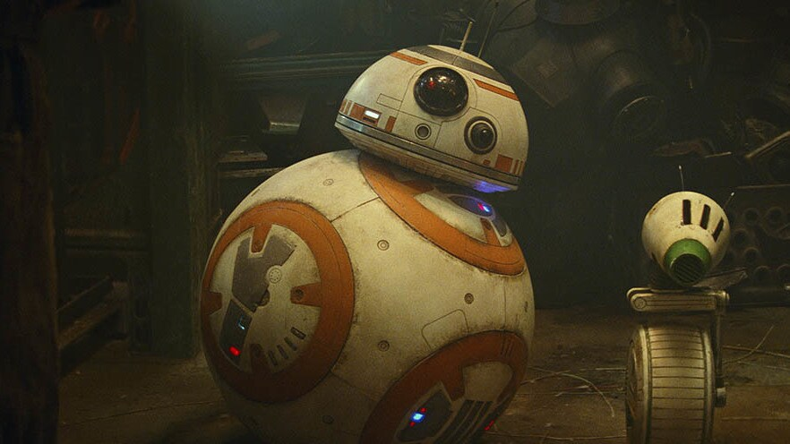

# 2D Ballbot – Modelování a řízení pomocí LQR a MPC

Tento semestrální projekt se zabývá modelováním a řízením balancujícího robota (tzv. *ballbot*), který se pohybuje ve 2D rovině po kouli. Cílem je navrhnout řízení schopné stabilizovat systém pomocí metod **LQR** (Lineární kvadratický regulátor) a **MPC** (Prediktivní řízení) na základě:

- odvozeného nelineárního modelu pomocí Lagrangeových rovnic,
- linearizace v okolí rovnovážného bodu,
- implementace řízení v jazycích MATLAB a Python (OSQP solver).

## Obsah

- [Popis systému](#popis-systému)
- [Matematický model](#matematický-model)
- [Linearizace a diskrétní model](#linearizace-a-diskrétní-model)
- [LQR řízení (MATLAB)](#lqr-řízení-matlab)
- [MPC řízení (Python)](#mpc-řízení-python)
- [Simulace a výsledky](#simulace-a-výsledky)
- [Závěr](#závěr)

---

## Popis systému

Model systému byl inspirován droidem BB8 ze StarWars.  
Je to nestabilní dynamický systém složený z:

- **duté koule** (balón), která se může otáčet a tím se i posouvat po podložce,
- **těla robota**, které balancuje na kouli.

Pohyb je omezen pouze na jednu rovinu, čímž vzniká 2D model, kde je řízen pouze jeden stupeň volnosti pohybu po podložce a jeden stupeň volnosti náklonu těla.

Akční člen je realizován jako **moment působící na kouli** kolem horizontální osy. Tento moment způsobuje její otáčení a tím i posun po zemi. Cílem řízení je udržet těžiště robota nad koulí, tedy stabilizovat vertikální polohu těla.

### Schéma systému

### Ilustrační obrázek robota

## Matematický model

### Tabulka konstant

| Symbol           | Význam                                 | Hodnota  | Jednotka |
|------------------|----------------------------------------|----------|----------|
| mb    | hmotnost koule                         | 2.5      | kg       |
| mt    | hmotnost těla                          | 1.0      | kg       |
| Jb    | moment setrvačnosti koule              | 0.085    | kg·m²    |
| Rb    | poloměr koule                          | 0.16     | m        |
| l                | vzdálenost těžiště těla od středu koule| 0.6      | m        |
| g                | gravitační zrychlení                   | 9.81     | m/s²     |

### Stavové veličiny

| Stavová veličina | Význam                   | Jednotka |
|------------------|-------------------------|----------|
| x1    | poloha koule            | m        |
| x2    | rychlost koule          | m/s      |
| x3    | úhel náklonu těla       | rad      |
| x4    | úhlová rychlost těla    | rad/s    |

---