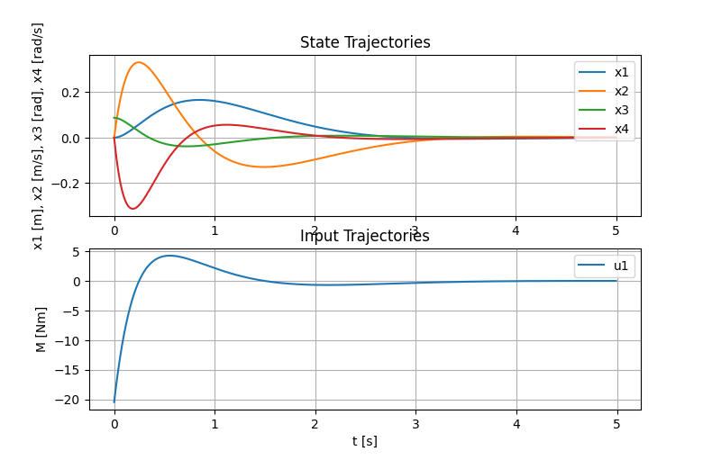
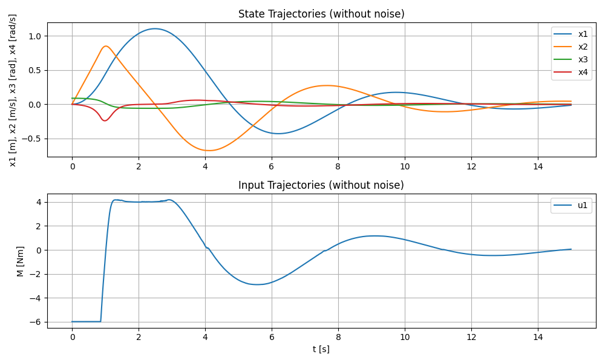
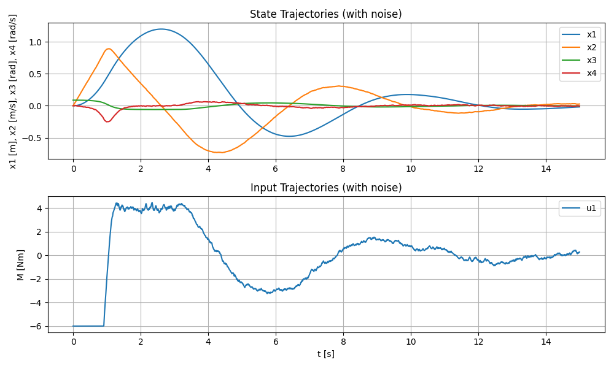

# 2D Ballbot – Modelování a řízení pomocí LQR a MPC

Tento semestrální projekt se zabývá modelováním a řízením balancujícího robota (tzv. *ballbot*), který se pohybuje ve 2D rovině po kouli. Cílem je navrhnout řízení schopné stabilizovat systém pomocí metod **LQR** (Lineární kvadratický regulátor) a **MPC** (Prediktivní řízení) na základě:

- odvozeného nelineárního modelu pomocí Lagrangeových rovnic,
- linearizace v okolí rovnovážného bodu,
- implementace řízení v jazycích MATLAB a Python (OSQP solver).

## Obsah

- [Popis systému](#popis-systému)
- [Matematický model](#matematický-model)
- [Linearizace a diskrétní model](#linearizace-a-diskrétní-model)
- [LQR řízení na nekonečném horizontu (Infinite Horizon LQR)](#lqr-řízení-na-nekonečném-horizontu-infinite-horizon-lqr)
- [MPC řízení s konečným horizontem (Finite Horizon MPC)](#mpc-řízení-s-konečným-horizontem-finite-horizon-mpc)
- [Závěr](#závěr)

---

## Popis systému

Model systému byl inspirován droidem BB8 ze StarWars.  
Je to nestabilní dynamický systém složený z:

- **duté koule** (balón), která se může otáčet a tím se i posouvat po podložce,
- **těla robota**, které balancuje na kouli.

Pohyb je omezen pouze na jednu rovinu, čímž vzniká 2D model, kde je řízen pouze jeden stupeň volnosti pohybu po podložce a jeden stupeň volnosti náklonu těla.

Akční člen je realizován jako **moment působící na kouli** kolem horizontální osy. Tento moment způsobuje její otáčení a tím i posun po zemi. Cílem řízení je udržet těžiště robota nad koulí, tedy stabilizovat vertikální polohu těla.

### Ilustrační obrázek robota


### Schéma systému


## Matematický model

### Tabulka konstant

| Symbol           | Význam                                 | Hodnota  | Jednotka |
|------------------|----------------------------------------|----------|----------|
| m<sub>b</sub>    | hmotnost koule                         | 2.5      | kg       |
| m<sub>t</sub>    | hmotnost těla                          | 1.0      | kg       |
| J<sub>b</sub>    | moment setrvačnosti koule              | 0.085    | kg·m²    |
| R                | poloměr koule                          | 0.16     | m        |
| l                | vzdálenost těžiště těla od středu koule| 0.6      | m        |
| g                | gravitační zrychlení                   | 9.81     | m/s²     |

### Stavové veličiny

> **Poznámka:** Stavová veličina $x_1$ (poloha koule) je v modelu přepočítána z úhlu natočení koule $\theta$ podle vztahu $x = R_b \cdot \theta$.

| Symbol            | Stavová veličina | Význam                   | Jednotka |
|-------------------|------------------|--------------------------|----------|
| $x(t)$            | $x_1$            | poloha koule             | m        |
| $\dot{x}(t)$      | $x_2$            | rychlost koule           | m/s      |
| $\varphi(t)$      | $x_3$            | úhel náklonu těla        | rad      |
| $\dot{\varphi}(t)$| $x_4$            | úhlová rychlost těla     | rad/s    |

---

### Polohy a rychlosti

> **Poznámka:** Pro přehlednost není v následujících rovnicích explicitně uváděna závislost na čase, tedy např. místo $x(t)$ je psáno pouze $x$.  
> Například: $x = R \cdot \theta$ znamená $x(t) = R \cdot \theta(t)$.

#### Poloha a rychlost středu koule

$$
x = R \cdot \theta
$$
$$
y = R
$$

$$
\dot{x} = R \cdot \dot{\theta}
$$
$$
\dot{y} = 0
$$

#### Poloha a rychlost středu těla robota

$$
x_{t} = x + l \cdot \sin(\varphi)
$$
$$
y_{t} = l \cdot \cos(\varphi)
$$

$$
\dot{x}_{t} = \dot{x} + l \cdot \cos(\varphi) \cdot \dot{\varphi}
$$
$$
\dot{y}_{t} = -l \cdot \sin(\varphi) \cdot \dot{\varphi}
$$

---

### Lagrangeova rovnice

Obecný tvar Lagrangeovy rovnice druhého druhu:
$$
\frac{d}{dt} \left( \frac{\partial L}{\partial \dot{q}_i} \right) - \frac{\partial L}{\partial q_i} = Q_i
$$
> kde $q_i$ jsou zobecněné souřadnice, $\dot{q}_i$ jejich časové derivace, $L$ je Lagrangián a $Q_i$ jsou zobecněné síly.

#### Lagrangián

$$
L = E_k - E_p
$$

> kde $E_k$ je celková kinetická energie a $E_p$ je celková potenciální energie systému.

---

### Kinetická energie

**Koule:**

- Translační složka:  
  $$
  E_{k,\text{trans, koule}} = \frac{1}{2} m_b \cdot \dot{x}^2
  $$

- Rotační složka:  
  $$
  E_{k,\text{rot, koule}} = \frac{1}{2} J_b \cdot \dot{\theta}^2
  $$

**Tělo:**

- Translační složka:  
  $$
  E_{k,\text{trans, tělo}} = \frac{1}{2} m_t \left( \dot{x}_t^2 + \dot{y}_t^2 \right)
  $$

**Tělo:**
$$
E_k = E_{k,\text{trans, koule}} + E_{k,\text{rot, koule}} + E_{k,\text{trans, tělo}}
$$

---

### Potenciální energie

Pouze pro tělo robota (u koule se potenciální energie nemění):

$$
E_p = m_t \cdot g \cdot y_t
$$

> Potenciální energie koule je konstantní a pro dynamiku systému se neuvažuje.
---

### Výsledné Lagrangeovy rovnice

Po dosazení energií a vyřešení derivací získáme dvě nelineární diferenciální rovnice popisující dynamiku systému:

$$
m_b \cdot \ddot{x} + J_b \cdot \frac{\ddot{x}}{R^2} + m_t \cdot l \cdot \left( -\sin(\varphi) \cdot \dot{\varphi}^2 + \cos(\varphi) \cdot \ddot{\varphi} \right) + m_t \cdot \ddot{x} = M_x
$$

$$
m_t \cdot l^2 \cdot \ddot{\varphi} + m_t \cdot l \cdot \left( \ddot{x} \cdot \cos(\varphi) - \dot{x} \cdot \sin(\varphi) \cdot \dot{\varphi} \right) - l \cdot \sin(\varphi) \cdot m_t \cdot g + l \cdot \sin(\varphi) \cdot m_t \cdot \dot{x} \cdot \dot{\varphi} = 0
$$

> Síla $Q_1$ odpovídá momentu $M_x$ působícímu na kouli.(vím, že tam měla být síla a ne moment, ale všiml jsem si toho až po dokončení simulace a nechtělo se mi to předělávat)

### Stavový vektor a pravé strany diferenciálních rovnic

Pro další zpracování (například při simulaci v MATLABu) lze soustavu zapsat ve vektorovém tvaru jako:

$$
\mathbf{\dot{x}} = f(\mathbf{x}, u)
$$

kde $\mathbf{x}$ je stavový vektor a $u$ je vstup (moment $M_x$).

Po dosazení a úpravě ve stavových proměnných dostáváme:

$$
\left(
\begin{array}{c}
x_2 \\
-\dfrac{R^2 \left(u + g\,m_t \cos(x_3)\sin(x_3)\right)}{J_b + R^2 m_b + R^2 m_t - R^2 m_t \cos^2(x_3)} \\
x_4 \\
\dfrac{R^2 u \cos(x_3) + J_b g \sin(x_3) + R^2 g m_b \sin(x_3) + R^2 g m_t \sin(x_3)}{l \left(J_b + R^2 m_b + R^2 m_t - R^2 m_t \cos^2(x_3)\right)}
\end{array}
\right)
$$

kde platí:
- $\mathbf{x} = \begin{pmatrix} x_1 \\ x_2 \\ x_3 \\ x_4 \end{pmatrix} = \begin{pmatrix} x \\ \dot{x} \\ \varphi \\ \dot{\varphi} \end{pmatrix}$
- $u$ je vstupní moment $M_x$


## Linearizace a diskrétní model

### Analýza singulárních bodů

Singulární body (rovnovážné stavy) systému byly nalezeny, položením derivace stavového vektoru rovny nule, tedy $\mathbf{\dot{x}} = 0$. Řešením této podmínky byly získány dva singulární body:

$$
[u,\, x_2,\, x_3,\, x_4] = [0,\, 0,\, 0,\, 0]
$$

a

$$
[u,\, x_2,\, x_3,\, x_4] = [0,\, 0,\, \pi,\, 0]
$$

Tyto body odpovídají situacím, kdy je tělo robota buď ve svislé dolní poloze ($x_3 = 0$), nebo ve svislé horní poloze ($x_3 = \pi$), přičemž poloha $x$ (tedy $x_1$) není omezena.

- **Bod $[0,\, 0,\, 0,\, 0]$**: tělo je nahoře (nestabilní rovnováha).
- **Bod $[0,\, 0,\, \pi,\, 0]$**: tělo je dole (stabilní rovnováha).

V dalším návrhu řízení budu systém linearizovat a řídit v okolí prvního singulárního bodu, tedy kolem stavu, kdy tělo balancuje nahoře.

### Linearizace v singulárním bodě

Pro návrh řízení je potřeba systém linearizovat v okolí zvoleného singulárního bodu (zde $[0,\, 0,\, 0,\, 0]$ – tělo nahoře).

Linearizace nelineárního systému probíhá pomocí výpočtu Jacobiho matice parciálních derivací pravých stran podle stavových proměnných:

$$
A = \left. \frac{\partial f(\mathbf{x}, u)}{\partial \mathbf{x}} \right|_{\mathbf{x}_0,\, u_0}
$$

Obecně má Jacobiho matice tvar $4 \times 4$:

$$
A =
\begin{pmatrix}
\frac{\partial f_1}{\partial x_1} & \frac{\partial f_1}{\partial x_2} & \frac{\partial f_1}{\partial x_3} & \frac{\partial f_1}{\partial x_4} \\
\frac{\partial f_2}{\partial x_1} & \frac{\partial f_2}{\partial x_2} & \frac{\partial f_2}{\partial x_3} & \frac{\partial f_2}{\partial x_4} \\
\frac{\partial f_3}{\partial x_1} & \frac{\partial f_3}{\partial x_2} & \frac{\partial f_3}{\partial x_3} & \frac{\partial f_3}{\partial x_4} \\
\frac{\partial f_4}{\partial x_1} & \frac{\partial f_4}{\partial x_2} & \frac{\partial f_4}{\partial x_3} & \frac{\partial f_4}{\partial x_4}
\end{pmatrix}
$$

Po dosazení hodnot singulárního bodu do Jacobiho matice byla získána konkrétní matice dynamiky $A$ systému v okolí tohoto bodu:

$$
A =
\begin{pmatrix}
0 & 1.0000 & 0 & 0 \\
0 & 0 & -1.6855 & 0 \\
0 & 0 & 0 & 1.0000 \\
0 & 0 & 19.1591 & 0
\end{pmatrix}
$$

Obdobně byla získána i matice vstupů $B$:

$$
B =
\begin{pmatrix}
0 \\
-0.1718 \\
0 \\
0.2864
\end{pmatrix}
$$

Matice $C$ a $D$ byly voleny tak, aby měl systém dva výstupy (pozici a úhel) a neměl žádnou přímou vazbu vstupu na výstup:

$$
C =
\begin{pmatrix}
1.0000 & 0 & 0 & 0 \\
0 & 0 & 57.2958 & 0
\end{pmatrix}
$$

$$
D =
\begin{pmatrix}
0 \\
0
\end{pmatrix}
$$

První výstup odpovídá poloze $x$, druhý výstup úhlu $\varphi$ (ve stupních).

Shrnutím předchozích kroků jsem tedy odvodil linearizovaný model systému ve tvaru stavových rovnic:

$$
\dot{\mathbf{x}} = A\mathbf{x} + B u
$$

$$
\mathbf{y} = C\mathbf{x} + D u
$$

kde $\mathbf{x}$ je stavový vektor, $u$ je vstup (moment $M_x$) a $\mathbf{y}$ je vektor výstupů (poloha a úhel).

---

### Diskretizace modelu

V následujících částech bude tento spojitý (kontinuální) model převeden na diskrétní pomocí Eulerovy metody. Diskretizace je nezbytná pro implementaci řízení v digitálním počítači a pro návrh prediktivního řízení (MPC). Výsledný diskrétní model bude použit v dalších návrhových a simulačních krocích.

Obecně lze Eulerovu metodu pro diskretizaci stavových rovnic zapsat jako:
$$
\mathbf{x}_{k+1} = \mathbf{x}_k + T_s \cdot \dot{\mathbf{x}}_k
$$
kde $T_s$ je vzorkovací perioda. Pro lineární systém $\dot{\mathbf{x}} = A\mathbf{x} + B u$ pak platí:
$$
\mathbf{x}_{k+1} = (I + T_s A)\mathbf{x}_k + T_s B u_k
$$

## LQR řízení na nekonečném horizontu (Infinite Horizon LQR)

LQR (Linear Quadratic Regulator) je metoda optimálního řízení, která minimalizuje kvadratické kritérium výkonu pro lineární systém. V nekonečném horizontu hledáme takové řízení, které minimalizuje sumu vážených odchylek stavů a vstupů po neomezeně dlouhou dobu.

### Kritérium výkonu

Pro diskrétní lineární systém
$$
x_{k+1} = A x_k + B u_k
$$
je optimalizační kritérium (cost function) ve tvaru:
$$
J = \sum_{k=0}^{\infty} \left( x_k^\top Q x_k + u_k^\top R u_k \right)
$$
kde $Q \succeq 0$ je váhová matice stavů a $R \succ 0$ je váhová matice vstupů.

Cílem LQR je nalézt takové řízení $u_k$, které minimalizuje tuto sumu kvadratických odchylek stavů a vstupů po nekonečný horizont.

---

### Implementace v Pythonu ([dLQR_IH.py](Python/dLQR_IH.py))

#### 0. Definice nelineární funkce f

Pro simulaci reálného chování systému je použita nelineární funkce `f`, která odpovídá odvozenému nelineárního modelu ballbota:

```python
def f(t, x, u):
    x1, x2, x3, x4 = [float(xx) for xx in x]
    u = float(u)
    return np.array([
        x2,
        (-R_b**2 * (u + g * m_t * np.cos(x3) * np.sin(x3))) / (J_b + R_b**2 * (m_b + m_t - m_t * np.cos(x3)**2)),
        x4,
        (R_b**2 * u * np.cos(x3) + J_b * g * np.sin(x3) + R_b**2 * g * (m_b + m_t) * np.sin(x3)) / (l*(J_b + R_b**2 * (m_b + m_t - m_t * np.cos(x3)**2)))
    ])
```

Tato funkce je využita při simulaci odezvy systému na řízení LQR, aby bylo možné porovnat chování lineárního a nelineárního modelu.

#### 1. Definice modelu a diskretizace

Nejprve jsou definovány parametry systému, nelineární model a linearizované matice. Diskretizace je provedena Eulerovou metodou:

```python
#Continuous-time system matrices
A_con = np.array([[0, 1, 0, 0],
                  [0, 0, -1.6855, 0],
                  [0, 0, 0, 1],
                  [0, 0, 19.1591, 0]])

B_con = np.array([[0],
                  [-0.1718],
                  [0],
                  [0.2864]])

# linearized discrete-time dynamics
h = 1e-2  # time step

A = np.eye(4) + A_con * h   #Euler discretization
B = B_con * h               #Euler discretization
```

#### 2. Nastavení simulace a váhových matic

Počáteční stav je zvolen jako malá odchylka od horní rovnovážné polohy – konkrétně stabilizace z úhlu **5°** (počáteční stav $x_0 = [0,\, 0,\, 5^\circ,\, 0]$).  
Rovnovážný bod (equilibrium point), kolem kterého je systém linearizován a stabilizován, je:
$$
x_{eq} = [0,\, 0,\, 0,\, 0], \quad u_{eq} = 0
$$

```python
N = 500 # number of time steps

x0 = np.array([0.0, 0.0, np.deg2rad(5), 0.0])  # initial state stabilization from an angle of 5 degrees
x_eq = np.array([0.0, 0.0, 0.0, 0.0])  # equilibrium state
u_eq = np.array([0.0])  # equilibrium input

xs = np.zeros((4, N + 1))  # state trajectory
us = np.zeros((1, N))  # input trajectory

Q = np.diag([500, 10, 100, 10])  # state cost matrix   [pos, vel, angle, ang_vel]
R = np.array([1])  # input cost matrix
```

#### 3. Výpočet optimálního zisku K

Optimální zisk $K$ je vypočten řešením diskrétní algebraické Riccatiho rovnice:

```python
S = solve_discrete_are(A, B, Q, R)  # solution to the discrete-time algebraic Riccati equation
K = solve(R + B.T @ S @ B, B.T @ S @ A)  # optimal gain matrix
```

#### 4. Simulace systému s LQR regulátorem

Systém je simulován s použitím stavové zpětné vazby:

```python
solver = ode(f).set_integrator("dopri5")  # set up the ODE solver

xs[:, 0] = x0  # set initial state

for k in range(N):
    solver.set_initial_value(xs[:, k])  # reset initial conditions to last state
    us[:, k] = u_eq - K @ (xs[:, k] - x_eq)  # calculate control input
    solver.set_f_params(us[0, k])  # set control input in solver
    solver.integrate(h)  # integrate a single step
    xs[:, k + 1] = solver.y  # save result to states
```

#### 5. Vykreslení výsledků

Výsledné trajektorie stavů a vstupů jsou vykresleny pomocí knihovny `matplotlib`:

```python
t = np.arange(N + 1) * h  # časová osa pro stavy
t_u = np.arange(N) * h    # časová osa pro vstupy

fig, (ax1, ax2) = plt.subplots(2, 1)

for i in range(xs.shape[0]):
    ax1.plot(t, xs[i, :], label=f"x{i+1}")

for i in range(us.shape[0]):
    ax2.plot(t_u, us[i, :], label=f"u{i+1}")

ax1.legend(loc='upper right')
ax2.legend()
ax1.grid(True)
ax2.grid(True)
ax1.set_title("State Trajectories")
ax2.set_title("Input Trajectories")
ax1.set_ylabel("x1 [m], x2 [m/s], x3 [rad], x4 [rad/s]")
ax2.set_xlabel("t [s]")
ax2.set_ylabel("M [Nm]")

plt.show()
```

### Výsledek simulace

Na obrázku níže je vidět průběh stavových veličin a řídicího momentu při stabilizaci ballbota z počáteční odchylky 5° do horní rovnovážné polohy:



---

### Shrnutí

- Systém je řízen pomocí stavové zpětné vazby $u_k = u_{eq} - K(x_k - x_{eq})$.
- Zisk $K$ je vypočten řešením diskrétní algebraické Riccatiho rovnice.
- LQR umožňuje nastavit kompromis mezi rychlostí/stabilitou a velikostí řídicího zásahu volbou matic $Q$ a $R$.
- Výsledkem je stabilizace ballbota v okolí horní rovnovážné polohy.

## MPC řízení s konečným horizontem (Finite Horizon MPC)

Model Predictive Control (MPC) je pokročilá metoda řízení, která v každém kroku řeší optimalizační úlohu na konečném horizontu. MPC umožňuje zahrnout omezení na vstupy i stavy a je vhodná pro řízení systémů s omezeními.

### Kritérium výkonu

Pro diskrétní lineární systém
$$
x_{k+1} = A x_k + B u_k
$$
je optimalizační kritérium (cost function) na horizontu $N$ ve tvaru:
$$
J = x_N^\top Q_N x_N + \sum_{k=0}^{N-1} \left( x_k^\top Q x_k + u_k^\top R u_k \right)
$$
kde $Q$ je váhová matice stavů, $R$ váhová matice vstupů a $Q_N$ matice pro koncový stav.

Cílem MPC je v každém kroku minimalizovat tuto sumu kvadratických odchylek stavů a vstupů na zvoleném horizontu $N$, přičemž je možné zahrnout omezení na vstupy a stavy.

---

### Implementace v Pythonu ([dMPC_FH.py](Python/dMPC_FH.py))

#### 0. Definice nelineární funkce f

Pro simulaci reálného chování systému je použita stejná nelineární funkce `f` jako u LQR:

```python
def f(t, x, u):
    u = float(u)
    x1, x2, x3, x4 = [float(xx) for xx in x]
    return np.array([
        x2,
        (-R_b**2 * (u + g * m_t * np.cos(x3) * np.sin(x3))) / (J_b + R_b**2 * (m_b + m_t - m_t * np.cos(x3)**2)),
        x4,
        (R_b**2 * u * np.cos(x3) + J_b * g * np.sin(x3) + R_b**2 * g * (m_b + m_t) * np.sin(x3)) / (l*(J_b + R_b**2 * (m_b + m_t - m_t * np.cos(x3)**2)))
    ])
```

#### 1. Definice modelu a diskretizace

Parametry systému, linearizované matice a diskretizace (Eulerova metoda):

```python
A_con = np.array([[0, 1, 0, 0],
                  [0, 0, -1.6855, 0],
                  [0, 0, 0, 1],
                  [0, 0, 19.1591, 0]])

B_con = np.array([[0],
                  [-0.1718],
                  [0],
                  [0.2864]])

h = 1e-2  # time step

A = np.eye(4) + A_con * h   # Euler discretization
B = B_con * h               # Euler discretization

n = 4  # number of states
m = 1  # number of inputs
```

#### 2. Nastavení MPC úlohy

- Horizont řízení $N = 100$
- Počet simulovaných kroků $M = 1500$
- Počáteční stav: stabilizace z úhlu **5°**
- Omezení na vstup: $|u| \leq 6$
- Váhové matice: $Q = \mathrm{diag}(500, 10, 100, 10)$, $R = 1$

```python
N = 100  # MPC horizon
M = 1500  # total number of steps

x0 = np.array([0.0, 0.0, np.deg2rad(5), 0.0])  # initial state stabilization from an angle of 5 degrees
u_max = 6  # symmetric input limits

Q = np.diag([500, 10, 100, 10])  # state cost matrix   [pos, vel, angle, ang_vel]
R = np.array([1])  # input cost matrix
```

#### 3. Formulace QP úlohy pro OSQP

MPC úloha je převedena na kvadratické programování (QP), které je řešeno pomocí solveru OSQP. Jsou sestaveny matice a vektory pro optimalizaci:

```python
import osqp
import scipy.sparse as sp

# Objective matrix (P)
objective_matrix = sp.lil_matrix((N * (m + n), N * (m + n)))
objective_matrix[0:N*m, 0:N*m] += np.kron(np.eye(N), R)
objective_matrix[N*m:, N*m:] += np.kron(np.eye(N), Q)

# Objective vector (q)
objective_vector = np.zeros(N * m + N * n)

# Constraint matrix (A)
constraint_matrix = sp.lil_matrix((N * (n + m), N * (n + m)))
constraint_matrix[0:N*n, 0:N*m] += np.kron(np.eye(N), B)
constraint_matrix[0:N*n, N*m:] += np.kron(np.eye(N), -np.eye(n))
constraint_matrix[n:N*n, N*m:-n] += np.kron(np.eye(N-1), A)
constraint_matrix[N*n:, 0:N*m] += np.kron(np.eye(N), np.eye(m))

# Lower and upper bounds
lower_bounds = np.zeros(N * (n + m))
lower_bounds[N * n:] = -u_max
upper_bounds = np.zeros(N * (n + m))
upper_bounds[N * n:] = u_max

# OSQP model setup
model = osqp.OSQP()
model.setup(
    P=objective_matrix.tocsc(), q=objective_vector,
    A=constraint_matrix.tocsc(), l=lower_bounds, u=upper_bounds,
    verbose=False
)
```

#### 4. Simulace MPC řízení

V každém kroku je řešena QP úloha, aplikován první vstup a systém je simulován nelineárním modelem.  
Pomocí příznaku `USE_NOISE` lze jednoduše přepínat mezi simulací bez šumu a se šumem (náhodný šum z intervalu $\langle -1, 1 \rangle$):

```python
xs = np.zeros((n, M + 1))
us = np.zeros((m, M))
xs[:, 0] = x0

USE_NOISE = False  # Pokud True, bude přidán šum do vstupu

for i in range(M):
    lower_bounds[:n] = -A @ xs[:, i]
    upper_bounds[:n] = -A @ xs[:, i]
    model.update(l=lower_bounds, u=upper_bounds)

    results = model.solve()
    us[:, i] = results.x[:m]
    if USE_NOISE:
        noise = np.random.uniform(-1, 1, 2)
        noise = [noise[0]]
    else:
        noise = [0]

    xs[:, i + 1] = xs[:, i] + h * f(0, xs[:, i], us[:, i] + noise[0])
```

#### 5. Vykreslení výsledků

Výsledné trajektorie stavů a vstupů jsou vykresleny pomocí knihovny `matplotlib`. Nadpisy grafů se automaticky mění podle toho, zda je šum aktivní:

```python
t = np.arange(M + 1) * h
t_u = np.arange(M) * h

plt.figure(figsize=(10, 6))

noise_str = "with noise" if USE_NOISE else "without noise"

plt.subplot(2, 1, 1)
for i in range(4):
    labels = ["x1 [m]", "x2 [m/s]", "x3 [rad]", "x4 [rad/s]"]
    plt.plot(t, xs[i, :], label=labels[i])
plt.legend()
plt.grid(True)
plt.title(f"State Trajectories ({noise_str})")
plt.ylabel("x1 [m], x2 [m/s], x3 [rad], x4 [rad/s]")

plt.subplot(2, 1, 2)
plt.plot(t_u, us[0, :], label="u1")
plt.legend()
plt.grid(True)
plt.title(f"Input Trajectories ({noise_str})")
plt.xlabel("t [s]")
plt.ylabel("M [Nm]")

plt.tight_layout()
plt.show()
```

---

### Výsledek simulace

Níže jsou zobrazeny výsledky simulace MPC řízení pro stabilizaci ballbota z počáteční odchylky 5° do horní rovnovážné polohy. Byly provedeny dvě simulace:

- **Bez šumu:** vstupní moment je aplikován bez přidaného šumu.
- **Se šumem:** k řídicímu momentu je v každém kroku přičten náhodný šum z intervalu $\langle -1, 1 \rangle$ (generováno funkcí `np.random.uniform(-1, 1, 2)`).

#### Výsledek bez šumu



#### Výsledek se šumem



---

### Shrnutí

- MPC v každém kroku řeší optimalizační úlohu na konečném horizontu s omezeními na vstupy.
- Řízení je robustní vůči omezením a umožňuje snadno měnit váhy a horizont.
- Výsledkem je stabilizace ballbota v okolí horní rovnovážné polohy i za přítomnosti omezení na vstup.

